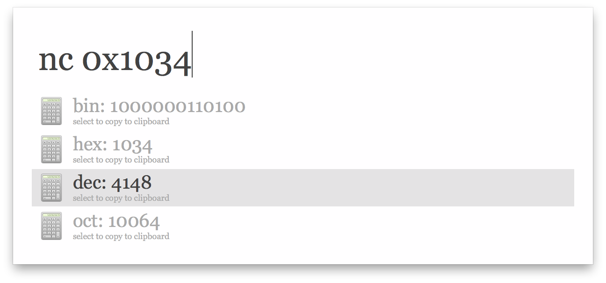
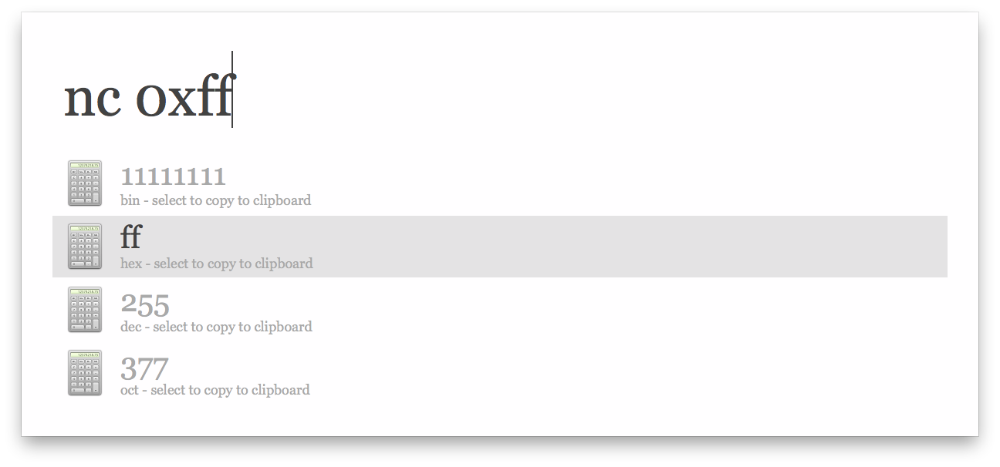

### Alfred Workflow: Number System Convertor

#### How to use

Convert a number to some number system: bin, dec, oct, hex

Just input `nc some number`, eg: `nc 100`, `nc 0xfe`

- to input binary number, start with `0b`, eg: `0b10010`
- to input decimal number, just input it
- to input octonary number, start with `0`, eg: `017`
- to input hexadeciaml number, start with `0x`, eg: `0xff`

Select an item to copy convert result to your clipboard.

#### Screenshot

